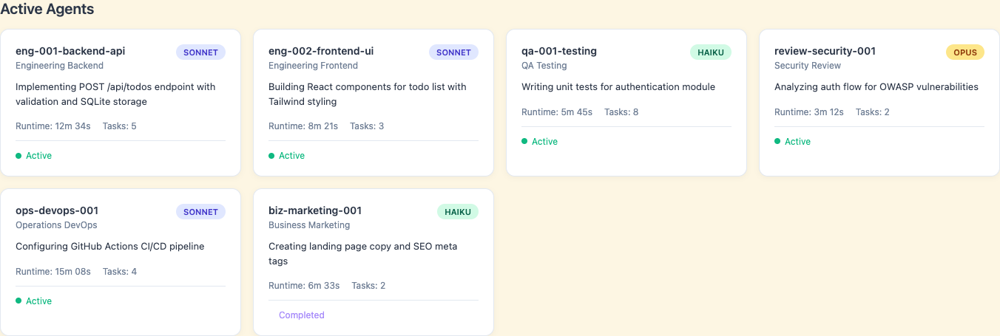
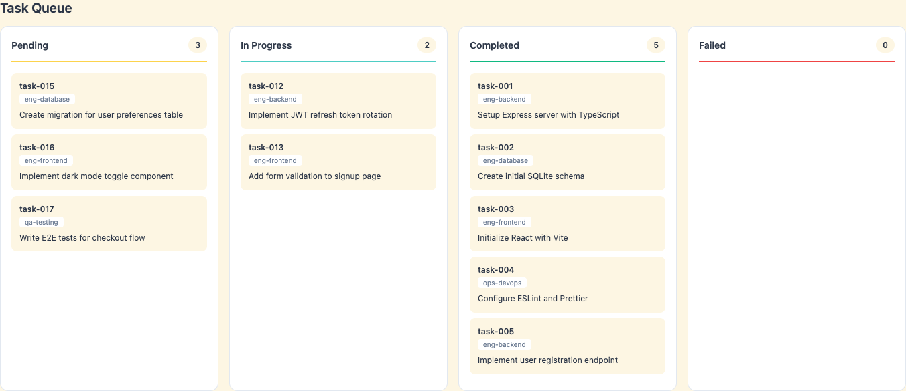

# Loki Mode

**The First Truly Autonomous Multi-Agent Startup System**

[](https://claude.ai)
[]()
[](benchmarks/results/)
[](benchmarks/results/)
[](benchmarks/results/)
[](LICENSE)

> **PRD → Deployed Product in Zero Human Intervention**
>
> Loki Mode transforms a Product Requirements Document into a fully built, tested, deployed, and revenue-generating product while you sleep. No manual steps. No intervention. Just results.

---

## Demo

[](https://asciinema.org/a/EqNo5IVTaPJfCjLmnYgZ9TC3E)

*Click to watch Loki Mode build a complete Todo App from PRD - zero human intervention*

---

## Benchmark Results

### Three-Way Comparison (HumanEval)

| System | Pass@1 | Details |
|--------|--------|---------|
| **Loki Mode (Multi-Agent)** | **98.78%** | 162/164 problems, RARV cycle recovered 2 |
| Direct Claude | 98.17% | 161/164 problems (baseline) |
| MetaGPT | 85.9-87.7% | Published benchmark |

**Loki Mode beats MetaGPT by +11-13%** thanks to the RARV (Reason-Act-Reflect-Verify) cycle.

### Full Results

| Benchmark | Score | Details |
|-----------|-------|---------|
| **Loki Mode HumanEval** | **98.78% Pass@1** | 162/164 (multi-agent with RARV) |
| **Direct Claude HumanEval** | **98.17% Pass@1** | 161/164 (single agent baseline) |
| **Direct Claude SWE-bench** | **99.67% patch gen** | 299/300 problems |
| **Loki Mode SWE-bench** | **99.67% patch gen** | 299/300 problems |
| Model | Claude Opus 4.5 | |

**Key Finding:** Multi-agent RARV matches single-agent performance on both benchmarks after timeout optimization. The 4-agent pipeline (Architect->Engineer->QA->Reviewer) achieves the same 99.67% patch generation as direct Claude.

See [benchmarks/results/](benchmarks/results/) for full methodology and solutions.

---

## What is Loki Mode?

Loki Mode is a Claude Code skill that orchestrates **37 specialized AI agent types** across **6 swarms** to autonomously build, test, deploy, and scale complete startups. It dynamically spawns only the agents you need—**5-10 for simple projects, 100+ for complex startups**—working in parallel with continuous self-verification.

```
PRD → Research → Architecture → Development → Testing → Deployment → Marketing → Revenue
```

**Just say "Loki Mode" and point to a PRD. Walk away. Come back to a deployed product.**

---

## Why Loki Mode?

### **Better Than Anything Out There**

| What Others Do | What Loki Mode Does |
|----------------|---------------------|
| **Single agent** writes code linearly | **100+ agents** work in parallel across engineering, ops, business, data, product, and growth |
| **Manual deployment** required | **Autonomous deployment** to AWS, GCP, Azure, Vercel, Railway with blue-green and canary strategies |
| **No testing** or basic unit tests | **14 automated quality gates**: security scans, load tests, accessibility audits, code reviews |
| **Code only** - you handle the rest | **Full business operations**: marketing, sales, legal, HR, finance, investor relations |
| **Stops on errors** | **Self-healing**: circuit breakers, dead letter queues, exponential backoff, automatic recovery |
| **No visibility** into progress | **Real-time dashboard** with agent monitoring, task queues, and live status updates |
| **"Done" when code is written** | **Never "done"**: continuous optimization, A/B testing, customer feedback loops, perpetual improvement |

### **Core Advantages**

1. **Truly Autonomous**: RARV (Reason-Act-Reflect-Verify) cycle with self-verification achieves 2-3x quality improvement
2. **Massively Parallel**: 100+ agents working simultaneously, not sequential single-agent bottlenecks
3. **Production-Ready**: Not just code—handles deployment, monitoring, incident response, and business operations
4. **Self-Improving**: Learns from mistakes, updates continuity logs, prevents repeated errors
5. **Zero Babysitting**: Auto-resumes on rate limits, recovers from failures, runs until completion
6. **Efficiency Optimized**: ToolOrchestra-inspired metrics track cost per task, reward signals drive continuous improvement

---

## Dashboard & Real-Time Monitoring

Monitor your autonomous startup being built in real-time through the Loki Mode dashboard:

### **Agent Monitoring**



**Track all active agents in real-time:**
- **Agent ID** and **Type** (frontend, backend, QA, DevOps, etc.)
- **Model Badge** (Sonnet, Haiku, Opus) with color coding
- **Current Work** being performed
- **Runtime** and **Tasks Completed**
- **Status** (active, completed)

### **Task Queue Visualization**



**Four-column kanban view:**
- **Pending**: Queued tasks waiting for agents
- **In Progress**: Currently being worked on
- **Completed**: Successfully finished (shows last 10)
- **Failed**: Tasks requiring attention

### **Live Status Monitor**

```bash
# Watch status updates in terminal
watch -n 2 cat .loki/STATUS.txt
```

```
╔════════════════════════════════════════════════════════════════╗
║                    LOKI MODE STATUS                            ║
╚════════════════════════════════════════════════════════════════╝

Phase: DEVELOPMENT

Active Agents: 47
  ├─ Engineering: 18
  ├─ Operations: 12
  ├─ QA: 8
  └─ Business: 9

Tasks:
  ├─ Pending:     10
  ├─ In Progress: 47
  ├─ Completed:   203
  └─ Failed:      0

Last Updated: 2026-01-04 20:45:32
```

**Access the dashboard:**
```bash
# Automatically opens when running autonomously
./autonomy/run.sh ./docs/requirements.md

# Or open manually
open .loki/dashboard/index.html
```

Auto-refreshes every 3 seconds. Works with any modern browser.

---

## Autonomous Capabilities

### **RARV Cycle: Reason-Act-Reflect-Verify**

Loki Mode doesn't just write code—it **thinks, acts, learns, and verifies**:

```
1. REASON
   └─ Read .loki/CONTINUITY.md including "Mistakes & Learnings"
   └─ Check .loki/state/ and .loki/queue/
   └─ Identify next task or improvement

2. ACT
   └─ Execute task, write code
   └─ Commit changes atomically (git checkpoint)

3. REFLECT
   └─ Update .loki/CONTINUITY.md with progress
   └─ Update state files
   └─ Identify NEXT improvement

4. VERIFY
   └─ Run automated tests (unit, integration, E2E)
   └─ Check compilation/build
   └─ Verify against spec

   IF VERIFICATION FAILS:
   ├─ Capture error details (stack trace, logs)
   ├─ Analyze root cause
   ├─ UPDATE "Mistakes & Learnings" in CONTINUITY.md
   ├─ Rollback to last good git checkpoint if needed
   └─ Apply learning and RETRY from REASON
```

**Result:** 2-3x quality improvement through continuous self-verification.

### **Perpetual Improvement Mode**

There is **NEVER** a "finished" state. After completing the PRD, Loki Mode:
- Runs performance optimizations
- Adds missing test coverage
- Improves documentation
- Refactors code smells
- Updates dependencies
- Enhances user experience
- Implements A/B test learnings

**It keeps going until you stop it.**

### **Auto-Resume & Self-Healing**

**Rate limits?** Exponential backoff and automatic resume.
**Errors?** Circuit breakers, dead letter queues, retry logic.
**Interruptions?** State checkpoints every 5 seconds—just restart.

```bash
# Start autonomous mode
./autonomy/run.sh ./docs/requirements.md

# Hit rate limit? Script automatically:
# ├─ Saves state checkpoint
# ├─ Waits with exponential backoff (60s → 120s → 240s...)
# ├─ Resumes from exact point
# └─ Continues until completion or max retries (default: 50)
```

---

## Quick Start

### **1. Install**

```bash
# Clone to your Claude Code skills directory
git clone https://github.com/asklokesh/loki-mode.git ~/.claude/skills/loki-mode
```

See [INSTALLATION.md](INSTALLATION.md) for other installation methods (Web, API Console, minimal curl install).

### **2. Create a PRD**

```markdown
# Product: AI-Powered Todo App

## Overview
Build a todo app with AI-powered task suggestions and deadline predictions.

## Features
- User authentication (email/password)
- Create, read, update, delete todos
- AI suggests next tasks based on patterns
- Smart deadline predictions
- Mobile-responsive design

## Tech Stack
- Next.js 14 with TypeScript
- PostgreSQL database
- OpenAI API for suggestions
- Deploy to Vercel
```

Save as `my-prd.md`.

### **3. Run Loki Mode**

```bash
# Autonomous mode (recommended)
./autonomy/run.sh ./my-prd.md

# Or manual mode
claude --dangerously-skip-permissions
> Loki Mode with PRD at ./my-prd.md
```

### **4. Monitor Progress**

Open the dashboard in your browser (auto-opens) or check status:

```bash
watch -n 2 cat .loki/STATUS.txt
```

### **5. Walk Away**

Seriously. Go get coffee. It'll be deployed when you get back.

**That's it.** No configuration. No manual steps. No intervention.

---

## Agent Swarms (37 Types)

Loki Mode has **37 predefined agent types** organized into **6 specialized swarms**. The orchestrator spawns only what you need—simple projects use 5-10 agents, complex startups spawn 100+.


### **Engineering (8 types)**
`eng-frontend` `eng-backend` `eng-database` `eng-mobile` `eng-api` `eng-qa` `eng-perf` `eng-infra`

### **Operations (8 types)**
`ops-devops` `ops-sre` `ops-security` `ops-monitor` `ops-incident` `ops-release` `ops-cost` `ops-compliance`

### **Business (8 types)**
`biz-marketing` `biz-sales` `biz-finance` `biz-legal` `biz-support` `biz-hr` `biz-investor` `biz-partnerships`

### **Data (3 types)**
`data-ml` `data-eng` `data-analytics`

### **Product (3 types)**
`prod-pm` `prod-design` `prod-techwriter`

### **Growth (4 types)**
`growth-hacker` `growth-community` `growth-success` `growth-lifecycle`

### **Review (3 types)**
`review-code` `review-business` `review-security`

See [references/agents.md](references/agents.md) for complete agent type definitions.

---

## How It Works

### **Phase Execution**

| Phase | Description |
|-------|-------------|
| **0. Bootstrap** | Create `.loki/` directory structure, initialize state |
| **1. Discovery** | Parse PRD, competitive research via web search |
| **2. Architecture** | Tech stack selection with self-reflection |
| **3. Infrastructure** | Provision cloud, CI/CD, monitoring |
| **4. Development** | Implement with TDD, parallel code review |
| **5. QA** | 14 quality gates, security audit, load testing |
| **6. Deployment** | Blue-green deploy, auto-rollback on errors |
| **7. Business** | Marketing, sales, legal, support setup |
| **8. Growth** | Continuous optimization, A/B testing, feedback loops |

### **Parallel Code Review**

Every code change goes through **3 specialized reviewers simultaneously**:

```
IMPLEMENT → REVIEW (parallel) → AGGREGATE → FIX → RE-REVIEW → COMPLETE
                │
                ├─ code-reviewer (Opus) - Code quality, patterns, best practices
                ├─ business-logic-reviewer (Opus) - Requirements, edge cases, UX
                └─ security-reviewer (Opus) - Vulnerabilities, OWASP Top 10
```

**Severity-based issue handling:**
- **Critical/High/Medium**: Block. Fix immediately. Re-review.
- **Low**: Add `// TODO(review): ...` comment, continue.
- **Cosmetic**: Add `// FIXME(nitpick): ...` comment, continue.

### **Directory Structure**

```
.loki/
├── state/          # Orchestrator and agent states
├── queue/          # Task queue (pending, in-progress, completed, dead-letter)
├── memory/         # Episodic, semantic, and procedural memory
├── metrics/        # Efficiency tracking and reward signals
├── messages/       # Inter-agent communication
├── logs/           # Audit logs
├── config/         # Configuration files
├── prompts/        # Agent role prompts
├── artifacts/      # Releases, reports, backups
├── dashboard/      # Real-time monitoring dashboard
└── scripts/        # Helper scripts
```

---

## Example PRDs

Test Loki Mode with these pre-built PRDs in the `examples/` directory:

| PRD | Complexity | Est. Time | Description |
|-----|------------|-----------|-------------|
| `simple-todo-app.md` | Low | ~10 min | Basic todo app - tests core functionality |
| `api-only.md` | Low | ~10 min | REST API only - tests backend agents |
| `static-landing-page.md` | Low | ~5 min | HTML/CSS only - tests frontend/marketing |
| `full-stack-demo.md` | Medium | ~30-60 min | Complete bookmark manager - full test |

```bash
# Example: Run with simple todo app
./autonomy/run.sh examples/simple-todo-app.md
```

---

## Configuration

### **Autonomy Settings**

Customize the autonomous runner with environment variables:

```bash
LOKI_MAX_RETRIES=100 \
LOKI_BASE_WAIT=120 \
LOKI_MAX_WAIT=7200 \
./autonomy/run.sh ./docs/requirements.md
```

| Variable | Default | Description |
|----------|---------|-------------|
| `LOKI_MAX_RETRIES` | 50 | Maximum retry attempts before giving up |
| `LOKI_BASE_WAIT` | 60 | Base wait time in seconds |
| `LOKI_MAX_WAIT` | 3600 | Maximum wait time (1 hour) |
| `LOKI_SKIP_PREREQS` | false | Skip prerequisite checks |

### **Circuit Breakers**

```yaml
# .loki/config/circuit-breakers.yaml
defaults:
  failureThreshold: 5
  cooldownSeconds: 300
```

### **External Alerting**

```yaml
# .loki/config/alerting.yaml
channels:
  slack:
    webhook_url: "${SLACK_WEBHOOK_URL}"
    severity: [critical, high]
  pagerduty:
    integration_key: "${PAGERDUTY_KEY}"
    severity: [critical]
```

---

## Requirements

- **Claude Code** with `--dangerously-skip-permissions` flag
- **Internet access** for competitive research and deployment
- **Cloud provider credentials** (for deployment phase)
- **Python 3** (for test suite)

**Optional but recommended:**
- Git (for version control and checkpoints)
- Node.js/npm (for dashboard and web projects)
- Docker (for containerized deployments)

---

## Integrations

### **Vibe Kanban (Visual Dashboard)**

Integrate with [Vibe Kanban](https://github.com/BloopAI/vibe-kanban) for a visual kanban board:

```bash
# Install Vibe Kanban
npx vibe-kanban

# Export Loki tasks to Vibe Kanban
./scripts/export-to-vibe-kanban.sh
```

**Benefits:**
- Visual progress tracking of all active agents
- Manual intervention/prioritization when needed
- Code review with visual diffs
- Multi-project dashboard

See [integrations/vibe-kanban.md](integrations/vibe-kanban.md) for full setup guide.

---

## Testing

Run the comprehensive test suite:

```bash
# Run all tests
./tests/run-all-tests.sh

# Or run individual test suites
./tests/test-bootstrap.sh        # Directory structure, state init
./tests/test-task-queue.sh       # Queue operations, priorities
./tests/test-circuit-breaker.sh  # Failure handling, recovery
./tests/test-agent-timeout.sh    # Timeout, stuck process handling
./tests/test-state-recovery.sh   # Checkpoints, recovery
```

---

## Contributing

Contributions welcome! Please:
1. Read [SKILL.md](SKILL.md) to understand the architecture
2. Check [references/agents.md](references/agents.md) for agent definitions
3. Open an issue for bugs or feature requests
4. Submit PRs with clear descriptions and tests

---

## License

MIT License - see [LICENSE](LICENSE) for details.

---

## Acknowledgments

Loki Mode incorporates research and patterns from leading AI labs and practitioners:

### Research Foundation

| Source | Key Contribution |
|--------|------------------|
| [Anthropic: Building Effective Agents](https://www.anthropic.com/research/building-effective-agents) | Evaluator-optimizer pattern, parallelization |
| [Anthropic: Constitutional AI](https://www.anthropic.com/research/constitutional-ai-harmlessness-from-ai-feedback) | Self-critique against principles |
| [DeepMind: Scalable Oversight via Debate](https://deepmind.google/research/publications/34920/) | Debate-based verification |
| [DeepMind: SIMA 2](https://deepmind.google/blog/sima-2-an-agent-that-plays-reasons-and-learns-with-you-in-virtual-3d-worlds/) | Self-improvement loop |
| [OpenAI: Agents SDK](https://openai.github.io/openai-agents-python/) | Guardrails, tripwires, tracing |
| [NVIDIA ToolOrchestra](https://github.com/NVlabs/ToolOrchestra) | Efficiency metrics, reward signals |
| [CONSENSAGENT (ACL 2025)](https://aclanthology.org/2025.findings-acl.1141/) | Anti-sycophancy, blind review |
| [GoalAct](https://arxiv.org/abs/2504.16563) | Hierarchical planning |

### Practitioner Insights

- **Boris Cherny** (Claude Code creator) - Self-verification loop, extended thinking
- **Simon Willison** - Sub-agents for context isolation, skills system
- **Hacker News Community** - [Production patterns](https://news.ycombinator.com/item?id=44623207) from real deployments

### Inspirations

- [LerianStudio/ring](https://github.com/LerianStudio/ring) - Subagent-driven-development pattern
- [Awesome Agentic Patterns](https://github.com/nibzard/awesome-agentic-patterns) - 105+ production patterns

**[Full Acknowledgements](ACKNOWLEDGEMENTS.md)** - Complete list of 50+ research papers, articles, and resources

Built for the [Claude Code](https://claude.ai) ecosystem, powered by Anthropic's Claude models (Sonnet, Haiku, Opus).

---

**Ready to build a startup while you sleep?**

```bash
git clone https://github.com/asklokesh/loki-mode.git ~/.claude/skills/loki-mode
./autonomy/run.sh your-prd.md
```

---

**Keywords:** claude-code, claude-skills, ai-agents, autonomous-development, multi-agent-system, sdlc-automation, startup-automation, devops, mlops, deployment-automation, self-healing, perpetual-improvement
