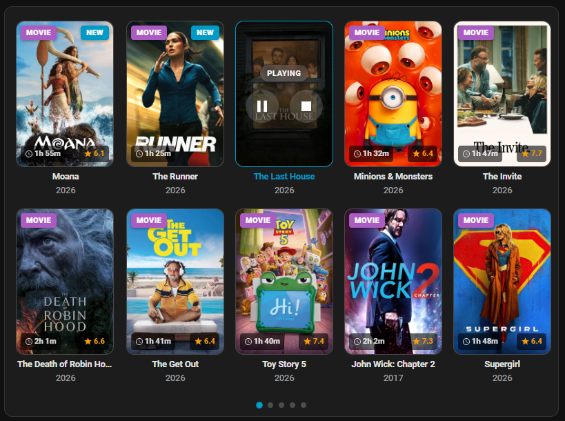
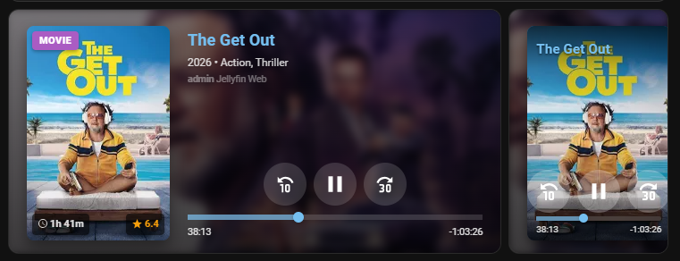
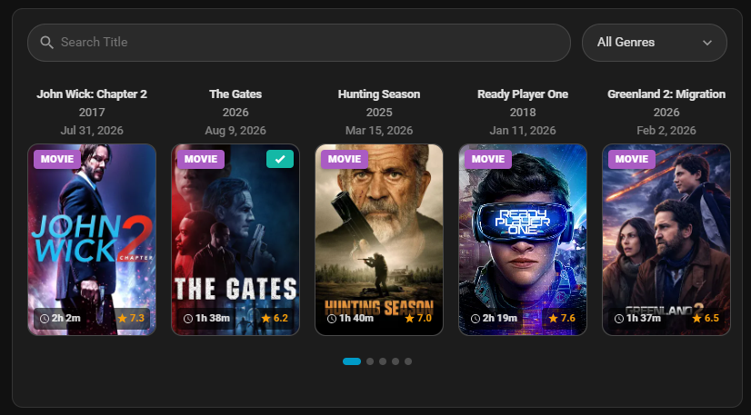
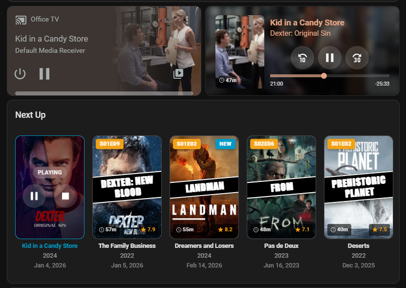
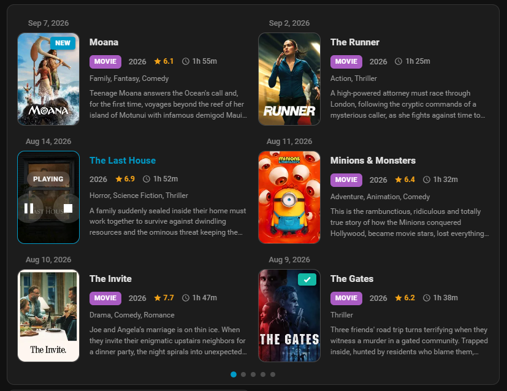
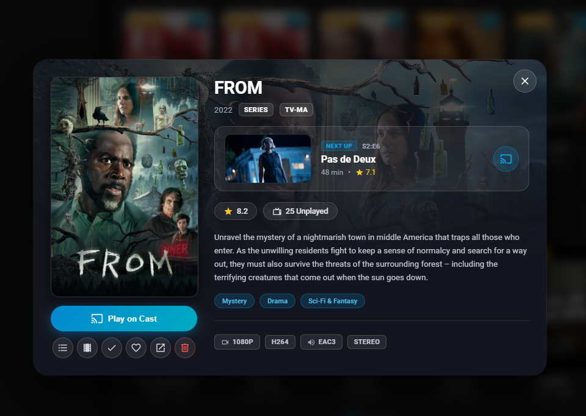

# JellyHA

[![HACS][hacs-badge]][hacs-url]
[![GitHub Release][release-badge]][release-url]

Jellyfin for Home Assistant

<div align="center">
  
  
</div>

<details>
  <summary><b>📸 Click to view all layout variations & screenshots (Carousel, List, Next Up, Details Modal, Card Selector)</b></summary>
  <br>
  <div align="center">
    
    
    
    
    
  </div>
</details>

## Features

- 🎬 Display movies and TV shows from your library
- 📺 Cast media directly to Chromecast (Gen 1 supported)
- ⏯️ Full playback control: Play, Pause, Stop, Seek, Next/Previous Track, Shuffle, Repeat
- ⏳ Accurate playback tracking: Elapsed/remaining time, +30s/-10s skip controls
- 🎮 Per-user media players with transport and volume controls
- 📺 Dedicated per-device media players for client devices (Smart TVs, Android TV, Fire TV sticks) for room-specific automations
- 🌈 Real-time Dynamic Range detection: Reporting of `SDR`, `HDR10`, `HDR10+`, `Dolby Vision`, and `HLG` on media players for picture mode automations (e.g. ADB TV control)
- ⏭️ "Next Up" support to resume TV shows
- 🎨 Three layouts: Carousel, Grid, List
- 🌙 Automatic dark/light theme adaptation
- 🔗 Click to open in Jellyfin (new tab)
- ⭐ IMDB ratings for movies, TMDB for TV shows
- 🆕 "New" badge for recently added items
- 🔍 Built-in Search Bar with Title and Genre filtering
- 🔐 Secure login via Username/Password or API Key
- 🤖 Advanced automation triggers via custom sensors & services
- 📂 Full integration with Home Assistant Media Browser
- 💾 Local storage caching
- ⚡ Instant loading via WebSocket
- 🌍 7 languages: English, German, French, Spanish, Italian, Dutch, Slovenian
- 🎛️ Graphical card editor (no YAML required)
- ⏱️ Configurable API Refresh Interval (via Integration Options)
- 🚀 **Multi-Instance Support**: Run multiple servers concurrently

## Documentation

For detailed references, configuration options, entity catalogs, and services, explore the dedicated documentation:

| Guide | Description |
|---|---|
| **[Dashboard Cards Configuration](docs/cards.md)** | Full YAML options, layout guides, and custom script execution variables for Library and Now Playing cards |
| **[Entities & Sensors Reference](docs/entities.md)** | Complete catalog of media players, library statistics, disk storage meters, and real-time updates architecture |
| **[Services Reference](docs/services.md)** | Playback, casting, search, library manipulation actions, and multi-instance targeting |
| **[Examples & Cookbook](examples/README.md)** | Ready-to-use automations, external player scripts (Android TV ADB, Apple TV, Kodi), and Lovelace layouts |
| **[AI Assistant Context (`llms.txt`)](llms.txt)** | Compact, authoritative reference file designed for prompt context in ChatGPT, Claude, and Cursor |
| **[Troubleshooting & FAQ](docs/troubleshooting.md)** | Solutions for custom element errors, browser caching, and diagnostic logging |

## Installation

JellyHA requires two setup steps: installing the integration and registering the dashboard card frontend resource.

### Step 1: Install the Integration

#### Via HACS (Recommended)

Before installing JellyHA, ensure you have **HACS (Home Assistant Community Store)** installed. Please follow the [official HACS installation guide](https://www.hacs.xyz/docs/use/download/download/) if needed.

**Option A: Using the Quick Link**

[](https://my.home-assistant.io/redirect/hacs_repository/?owner=zupancicmarko&repository=jellyha&category=Integration)

**Option B: Manual Search**

1. Open **HACS** in Home Assistant.
2. In the search bar, type **JellyHA**.
3. Select the **JellyHA** integration and click **Download**.
4. **Restart Home Assistant**.

#### Manual Installation

1. Copy `custom_components/jellyha` to your `config/custom_components/` directory.
2. **Restart Home Assistant**.

### Step 2: Add Dashboard Card Resource

> **Important:** This step is required for the dashboard cards to display.

1. Go to **Settings** -> **Dashboards**.
2. Click the three-dot menu (**⋮**) in the top right -> **Resources**.
3. Click **+ Add Resource**.
4. Enter the URL:
   - URL: `/jellyha/jellyha-cards.js`
5. Select Resource type: **JavaScript Module**.
6. Click **Create**.

> Note: If you do not see the Resources menu, enable **Advanced Mode** in your Home Assistant user profile settings.

## Setup

### Connect via Quick Link

[![My Home Assistant][my-ha-badge]][my-ha-url]

### Manual Setup

1. Go to **Settings** -> **Devices & Services** -> **Add Integration**.
2. Search for **JellyHA**.
3. Enter your Jellyfin server URL and select authentication method (**Username/Password** or **API Key**).
   - Optional: Enter an **External URL** if accessing via a reverse proxy or WAN address.
4. Enter your credentials or API key.
5. Select the user and libraries to monitor.
6. **Instance Label (Optional)**: Add a custom label (e.g., `4K Server`, `Kids`) when connecting multiple Jellyfin instances.
7. Click **Submit**.

### Integration Options

To adjust settings after initial configuration:

1. Go to **Settings** -> **Devices & Services** -> **JellyHA** -> **Configure**.
2. Adjust the **Library Refresh Interval** (from pure WebSocket push to periodic polling).
3. Select **Client/Device Media Players** to create dedicated media players for physical hardware (e.g. Smart TVs, Android TV boxes).
4. Set an **External URL** or trigger an immediate cache refresh.

### Getting a Jellyfin API Key

1. Open the Jellyfin Web Dashboard.
2. Go to **Administration** -> **Dashboard** -> **Advanced** -> **API Keys**.
3. Click **+** to generate a new key, and paste it into Home Assistant.

### Supported Library Types

| Library Type | Background Sync | Search Service | Now Playing |
|---|---|---|---|
| Movies | ✅ | ✅ | ✅ |
| TV Shows | ✅ | ✅ | ✅ |

## Dashboard Cards at a Glance

JellyHA includes two custom Lovelace cards with full visual UI editors (Add Card -> search for "JellyHA").

### Library Card (`custom:jellyha-library-card`)

Browse movies, series, episodes, and Next Up items with Carousel, Grid, or List layouts.

```yaml
type: custom:jellyha-library-card
entity: sensor.jellyha_library
title: Jellyfin Library
layout: carousel
media_type: both
items_per_page: 3
max_pages: 5
```

Supports custom click, hold, and double-tap actions (Cast, More Info, Open in Jellyfin, Play Trailer, or Run Script with complete item metadata passed automatically).

👉 **[See full Library Card configuration and script variables in docs/cards.md](docs/cards.md)**

### Now Playing Card (`custom:jellyha-now-playing-card`)

Display active playback status, progress bars, and transport controls with dynamic blurred backdrops.

```yaml
type: custom:jellyha-now-playing-card
entity: media_player.jellyha_admin # Supports per-user or per-device media players
title: Now Playing
show_background: true
```

👉 **[See full Now Playing Card options in docs/cards.md](docs/cards.md)**

## Media Browser

JellyHA integrates with Home Assistant's Media Browser:

1. Open **Media** in the Home Assistant sidebar.
2. Select **JellyHA**.
3. Choose your server (if multiple are connected).
4. Browse your collections and stream directly to your browser or Cast players.

*(If "Media" is not visible in the sidebar, see [Media Browser Entry Not Visible in Sidebar](docs/troubleshooting.md#media-browser-entry-not-visible-in-sidebar).)*

## Examples & Cookbook

Explore ready-to-use recipes in the dedicated **[Examples & Cookbook Library](examples/)**:

- **[Skip Intro Automatically](examples/automations/skip_intro.yaml)**: Jumps past TV show intros using segment detection.
- **[Cinema Lighting Experience](examples/automations/cinema_lighting_segments.yaml)**: Dims lights on playback and raises lights when credits roll.
- **[New Media Push Notification](examples/automations/new_movie_notification.yaml)**: Sends mobile notifications with artwork and dynamic range badges when new media is added.
- **[Play on Android TV / Wholphin (ADB)](examples/scripts/card_action_play_on_wholpin.yaml)**: Card click action to play directly on Wholphin via ADB without confirmation prompts.
- **[Cast with Custom Subtitles](examples/scripts/card_action_cast_with_subtitles.yaml)**: Routes library card clicks to Chromecast with prioritized subtitle selection (e.g. `sl, en`) and automatic server-side transcode burn-in.
- **[Play on Apple TV (Infuse)](examples/scripts/card_action_play_on_apple_tv.yaml)**: Routes library card clicks to Apple TV.
- **[Play on Kodi (JellyCon)](examples/scripts/card_action_play_on_kodi.yaml)**: Routes library card clicks to Kodi.
- **[System & Library Monitoring Stack](examples/dashboards/system_monitoring_card.yaml)**: Lovelace dashboard with server health, storage percentage meters, and library breakdown.

## Troubleshooting

For solutions to common issues, browser cache clearing, Android TV & Wholphin playback setup, and diagnostic logging:

👉 **[Read the complete Troubleshooting Guide in docs/troubleshooting.md](docs/troubleshooting.md)**

## Support

- [Report an issue](https://github.com/zupancicmarko/jellyha/issues)
- [Home Assistant Community](https://community.home-assistant.io/t/jellyha-jellyfin-custom-integration-for-home-assistant/981271/30)

## Acknowledgments

This project was developed with the assistance of AI.

## License

MIT

## Disclaimer

**Personal Use Only**  
This integration is provided as a neutral interface for your private media library. JellyHA does not provide, facilitate, or encourage the use of unauthorized or pirated content. By using this software, you agree that you are solely responsible for the legality of the media you host and stream.

[hacs-badge]: https://img.shields.io/badge/HACS-Custom-orange.svg
[hacs-url]: https://github.com/hacs/integration
[release-badge]: https://img.shields.io/github/v/release/zupancicmarko/jellyha
[release-url]: https://github.com/zupancicmarko/jellyha/releases
[my-ha-badge]: https://my.home-assistant.io/badges/config_flow_start.svg
[my-ha-url]: https://my.home-assistant.io/redirect/config_flow_start?domain=jellyha
